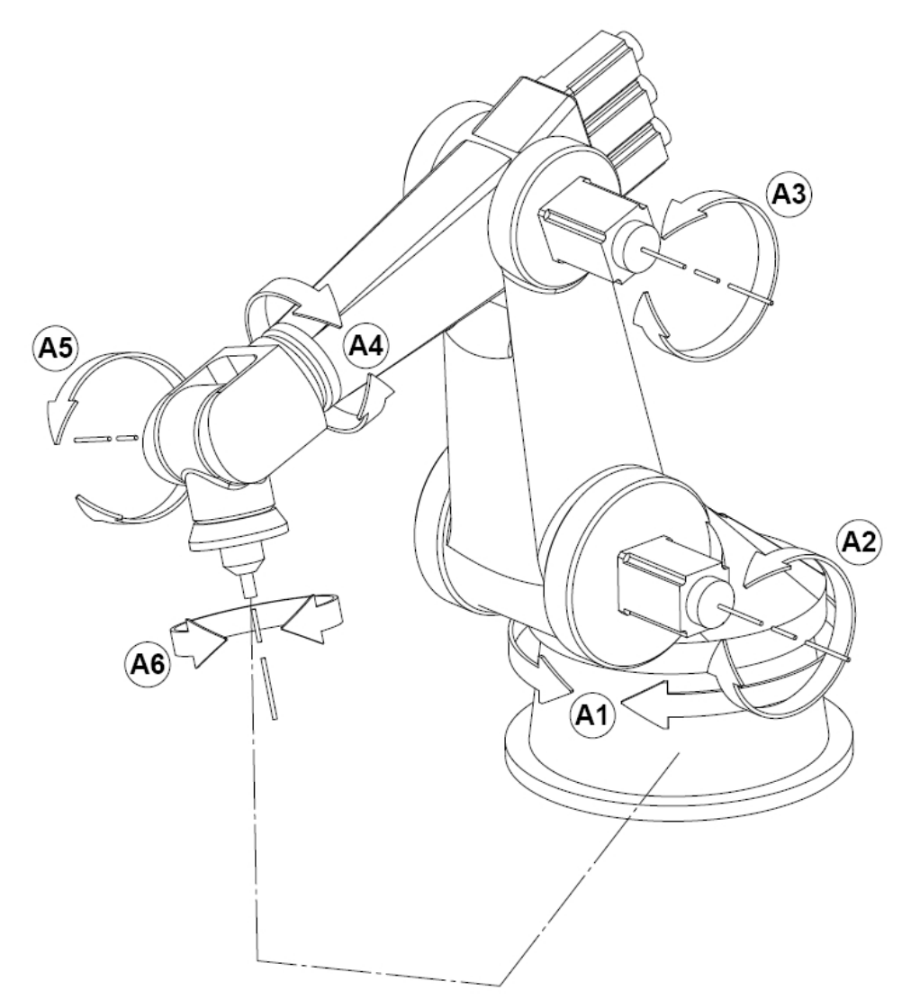

# robot_accuracy
Analysis of the accuracy of a 6-axis robot arm by comparing measurements to forward kinematic calculations

For this project I'm working with a dataset of positional measurements for a 6-axis robot arm with end-effector. The robot was commanded to assume 199 unique poses, with each pose defined by the six joint positions. At each pose, three points on the end effector (structure mounted beyond joint 6) were measured in Cartesian space. 

Each row of the dataset represents the robot in a single, unique pose, and there is data for 199 poses. For each pose, we have 
* **columns 1-6, (A1, A2, A3, A4, A5, A6), the joint angles the robot was commanded to** - angles that the robot was commanded to drive each axis to, in degrees. The angles "A1" through "A6" correspond to the angles "A1" through "A6" in the cartoon image above above.
* **columns 7-15, (XA, YA, ZA), the *actual/measured* location of the end effector** - (x, y, z) coordinates (in mm) of each of the three points on the end effector (sufficient to determine not just location but also orientation of robot's toolpoint)
* **columns 16-24, (XN, YN, ZN), the *nominal/expected* location of the end effector** - expected (x, y, z) coordinates (in mm) of the same three points were calculated  by feeding the joint positions to a forward kinematics model configured with nominal values for this robot (though not calibrated for this particular robot nor compensated for it's installation (that's actually the purpose the data was captured for!))
* **columns 25-36, (dx, dy, dz, err), the error in the kinematic model's prediction**  - (dx, dy, dz) are the coordinates (in mm) of the resultant vector if you subtract the nominal/expected position from the actual/measured position (i.e. the 3D error in the model), and "err" is the magnitude of that vector.
